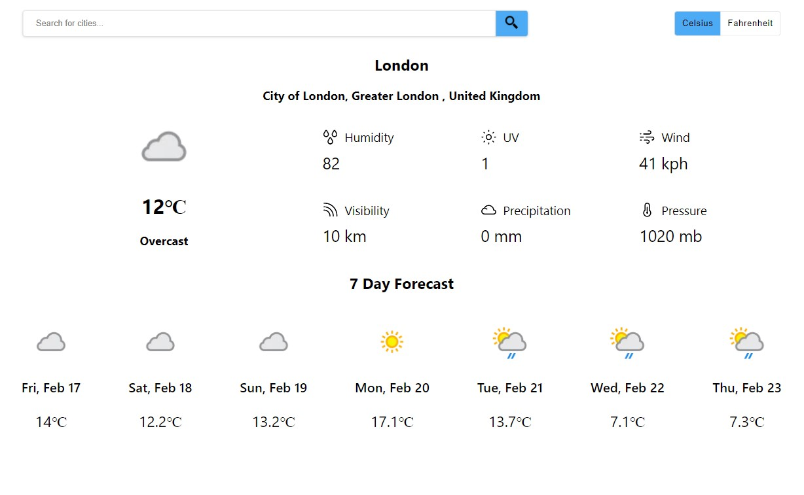

# Weather app

Weather app created using React JS and CSS.



## Tools and technology used

- React.js
- CSS
- Axios
- Netlify

## Getting Started

To get started:

- Clone the repo
  `git clone https://github.com/Akshaya-vc/weather-app-frontend.git`
- To start the project

```shell
yarn install
yarn start
```
- Checkout to a new branch.
  `git checkout -b testing`
- Make some amazing changes.
- `git add .`
- `git commit -m "<Verb>: <Action>"`
- `git push origin testing`
- Open a pull request :)

**For running this project successfully you'll need to create a `.env` file and store your [Weather API credentials](https://www.weatherapi.com/) as specified in [`.env.sample`](https://github.com/Akshaya-vc/weather-app-frontend/blob/master/.env.sample).**

## Usage


Check out the demo [here]()